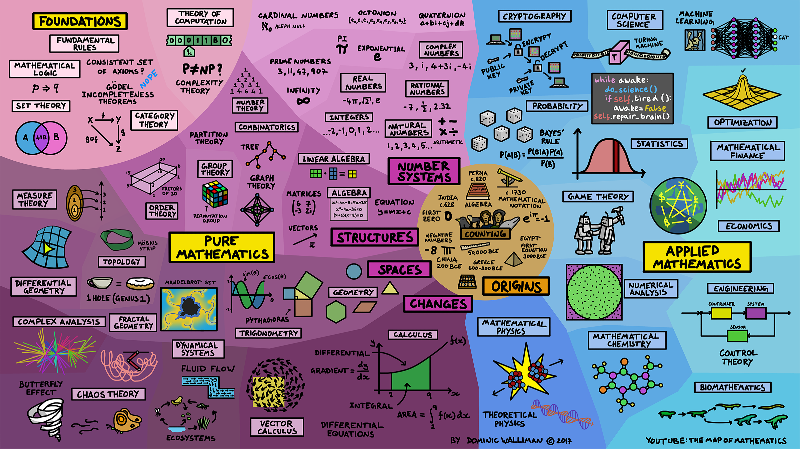

# 0 – Määritelmiä

> One reason why mathematics enjoys special esteem, above all other sciences, is that its laws are absolutely certain and indisputable, while those of other sciences are to some extent debatable and in constant danger of being overthrown by newly discovered facts. 
>
> —  Albert Einstein

## Kurssiesittely

!!! todo

    - Päivät
    - Kurssin rakenne
    - Läpipääsyvaatimukset
    - Oppimistavoitteet
    - Oppilaat avaavat kurssimateriaalin
    - Classroom

## Mitä on konstruktiivinen logiikka?

Konstruktiivinen logiikka on logiikan haara, jossa todistukset matemaattisista väitteistä sisältävät rakennetta ja ovat algoritmillisesti varmistettavissa.

Klassisessa logiikassa väitteiden oletetaan saavan totuusarvoiksi _tosi_ tai _epätösi_ riippumatta siitä löytyykö väitteelle tai sen negaatiolle todistusta. Konstruktiivinen logiikka ei tee tätä oletusta, vaan väitteet voidaan osoittaa todeksi ainoastaan konstruoimalla todistus väitteestä.

Konstruktiivisessa lauselogiikassa konnektiiveja $\rightarrow$, $\land$ ja $\lor$ ei ole määritetty totuustaulujen avulla, vaan muodostamalla kieli, jossa nämä konnektiivit konstruoidaan ja eliminoidaan käyttäen päättelysääntöjä. Lisäksi predikaattilogiikan kvanttorit ∃, ∀ esiintyvät _tyyppien_ abstraktiotasolla, kun konstruktiivisesta lauselogiikasta siirrytään _tyyppiteoriaan_.

## Mitä on formaali todistaminen?

!!! todo

    - Perinpohjainen
    - Miten oletuksista muodostetaan käytetyn logiikan sääntöjen mukaisesti haluttu lause (maali)?
    - Formaalin todistuksen pätevyys on objektiivista <https://www.cl.cam.ac.uk/~jrh13/slides/upitt-22mar07/slides.pdf>
    - Todistaminen koneavusteisesti, minimoidaan inhimiliset tekijät, jotta päästään mahdollisimman lähelle ideaalia tarkistusprosessia

## Mitä on funktionaalinen ohjelmointi?

!!! todo

    - Mitä on ohjelmointi?
    - Joissain ohjelmointikielissä suositaan funktioita ja "puhtautta", ja ne ovat lähempänä matematiikan käsitystä funktiosta. Funktiot näissä kielissä esittävät algoritmiä/laskentaa sen sijaan, että esittävät muutoksia tietokoneen tilassa.

## Mitä ovat rationaaliluvut?

!!! todo

### Todistus siitä, että $\sqrt 2$ on irrationaalinen

!!! todo

    - Lemma 1: Kaikille rationaaliluvuille löytyy supistettu muoto
    - By_contra: oletetaan että $\sqrt 2 = \frac n m$
    - Lemma 1 nojalla: on olemassa supistettu muoto $\frac p q = \frac n m = \sqrt 2$
    - Eipä ollu

## Matematiikka

!!! todo

    - Matematiikka on filosofian haara
    - Matematiikka on kieli, jota käytetään mm. fysiikassa, tilastotieteessä ja ohjelmoinnissa. 
    - Numerot ja abstraktit rakenteet keskeisiä
    - Puhataan ja sovelletun matematiikan eroavaisuudet
    - Voiko matematiikkaan luottaa?
    - Merkittäviä matemaatikkoja : Euler, Gauss, Gödel, Turing, Church, von Neumann 

## Logiikka

!!! todo

    - <https://files.eric.ed.gov/fulltext/ED601039.pdf>
    - Aksioomat ja perusta
    - Joukko-oppi, tyyppiteoria
    - Päättelysäännöt
    - Todistaminen
    - Totuus ja tieto
    - Mitä tarkoittaa epätosi?
      - Ovatko kaikki mitkä eivät ole epätotta totta?
    - Merkittäviä loogikkoja
    - Informaali ja formaali logiikka
      - Formaali tiede, <https://en.wikipedia.org/wiki/Formal_science#Differences_from_other_sciences> lainaus
    - Oletukset $\vdash$ johtopäätökset 

## Matematiikan perusta ja kriisi

!!! todo 
    - Suhtautuminen matematiikan perustaan on muuttunut viime 
    - Laajalti käytössä olevan aksiomaattisen pohjan 
